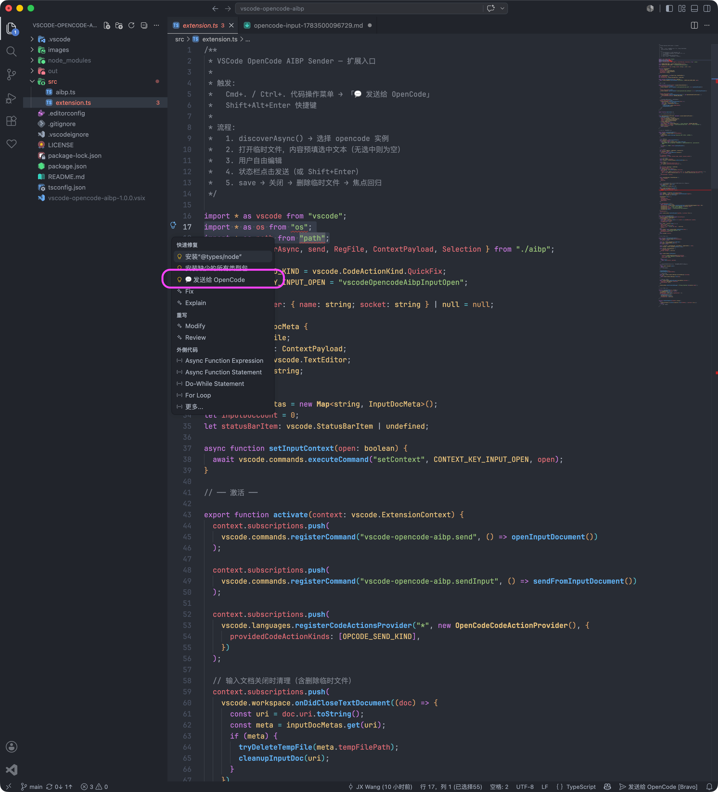
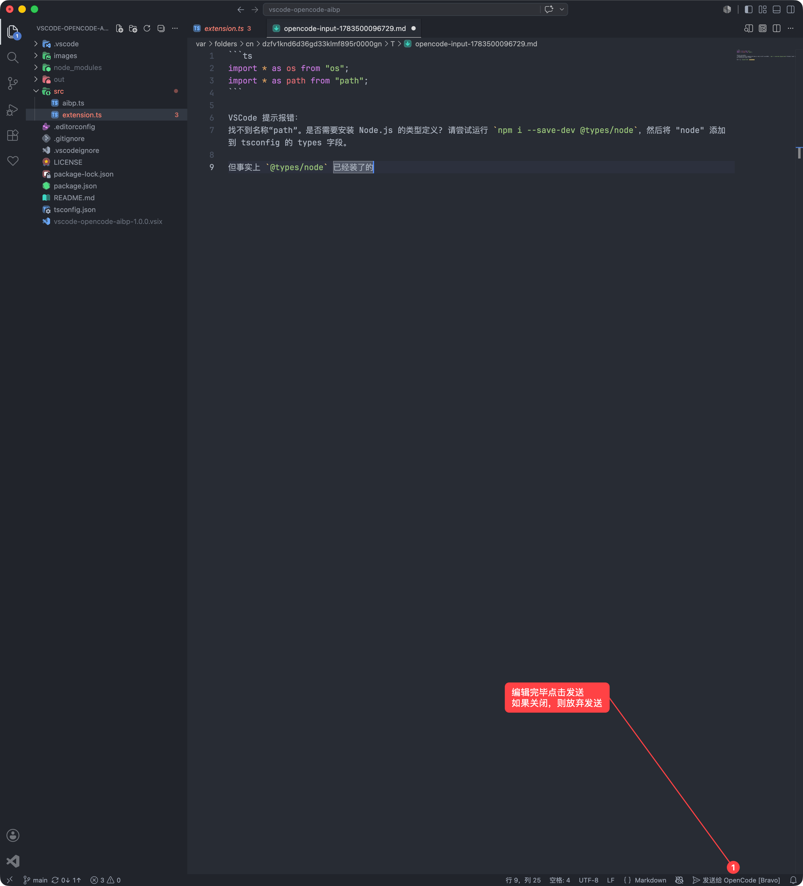
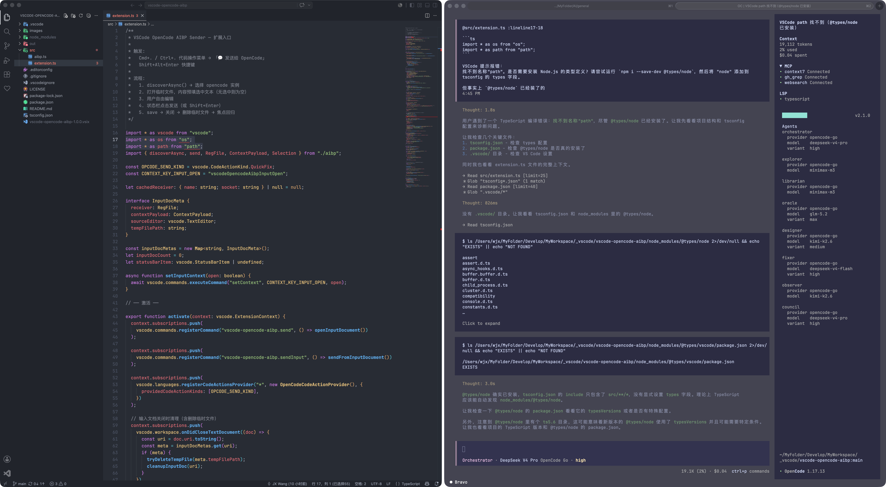

# OpenCode to AIBP

在 VSCode 中选中代码，一键发送到终端中正在运行的 OpenCode、pi，附带你的指令。

## 使用方式

1. 在编辑器中**选中文本**
2. 点击「快速修复」灯泡 → 选择「💬 发送给 AIBP」
3. 在打开的临时文件中**编辑指令**（所见即发送）
4. 点击状态栏 **$(send) 发送给 AIBP** 按钮

如需更换已选实例，打开命令面板并执行 **AIBP: 切换接收实例**；当前输入文档和之后新建的输入文档都会使用新选择的实例。





## 前置条件

OpenCode 端需要安装 AIBP 接收插件：

```bash
opencode plugin aibp-opencode -g
```

PI 需要安装：
```bash
pi install npm:aibp-pi
```

### 手动配置

编辑 `~/.config/opencode/tui.json`：
```json
{
    "$schema": "https://opencode.ai/tui.json",
    "plugin": ["aibp-opencode"]
}
```

安装后重启 OpenCode，底部状态栏出现 `● Alpha` 或 `● Bravo` 之类的标识即就绪。

## 特性

- **多实例支持** — 同时运行多个 OpenCode 时，首次选择目标实例，后续自动复用；可通过命令面板随时切换
- **WYSIWYG** — 在临时文件中写什么就发什么，支持多行、Markdown 格式
- **选区感知** — 自动携带文件名和光标/选区位置信息
- **代码操作菜单** — 集成到 VSCode 原生 `Cmd+.` 菜单，不占用快捷键

## 开发

```bash
npm install
npm run compile   # 或按 F5 启动调试
```

## 原理

基于 [microNeo](https://github.com/sollawen/microNeo) 的 **AIBP v2.0** 协议，通过 UNIX socket 与 OpenCode 的 `aibp-opencode` TUI 插件通信。

## License

MIT
